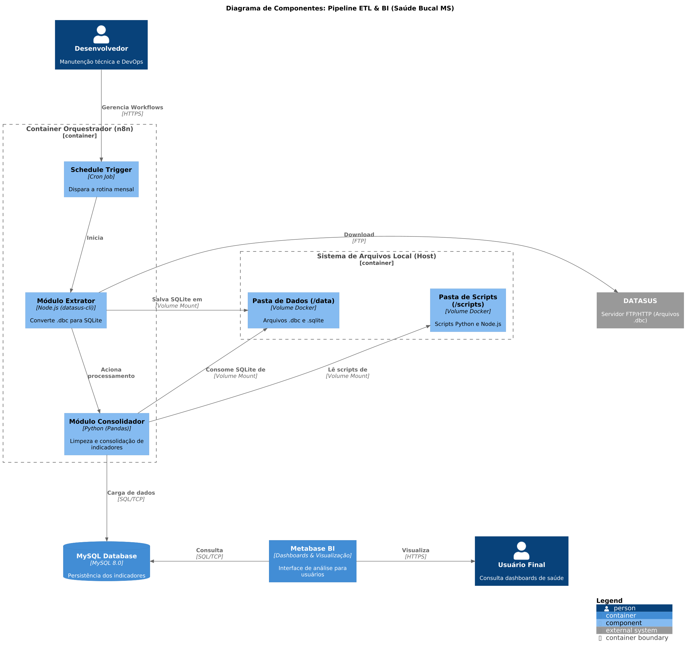

# ETL DATASUS - Monitoramento de Saúde Bucal (MS)

Este projeto automatiza a recolha, extração e processamento de indicadores de produção de saúde bucal do DATASUS. A solução utiliza uma arquitetura de microsserviços em containers Docker para garantir portabilidade e consistência, focando exclusivamente nos dados dos municípios do Estado de Mato Grosso do Sul (Código IBGE 50).

## 🏗️ Arquitetura do Sistema

A stack é orquestrada pelo **n8n**, que interage com o socket do host para instanciar containers temporários de processamento.



* **Orquestrador (n8n):** Roda na porta 5678, gere o fluxo de trabalho e o cron de execução.
* **Banco de Dados (MySQL 8.0):** Roda na porta 3306. Armazena a produção consolidada, dados de população e logs.
* **Extrator (Node.js 22 / datasus-cli):** Faz o download dos arquivos brutos (.dbc) do FTP do DATASUS e converte-os para bancos SQLite intermediários.
* **Consolidador (Python 3.10):** Lê os arquivos SQLite, aplica filtros de ocupação (CBO), consolida os dados de Mato Grosso do Sul e persiste no MySQL via `PyMySQL`.

## 📋 Pré-requisitos

* Docker e Docker Compose devidamente instalados.
* Acesso livre à porta `5678` (n8n) e `3306` (MySQL).
* Ligação à internet sem bloqueio de portas FTP (necessário para o datasus-cli).

## ⚙️ Instalação e Configuração

1. **Clonar o Repositório:**
   ```bash
   git clone [https://github.com/delarissag/n8n-datasus.git](https://github.com/delarissag/n8n-datasus.git)
   cd n8n-datasus
   ```

2. **Configuração de Ambiente (.env):**
   Crie um ficheiro `.env` na raiz do projeto. O `.gitignore` está configurado para não o rastrear. As credenciais são obrigatórias, o script Python irá abortar a execução se não as encontrar.
   ```env
   DB_HOST=mysql
   DB_USER=root
   DB_PASSWORD=sua_senha_segura
   DB_NAME=indicadores_sus
   ```

3. **Subir a Infraestrutura Inicial:**
   Este comando constrói a imagem do n8n (com o binário do Docker injetado) e sobe o MySQL.
   ```bash
   docker-compose up -d --build
   ```

4. **Configurar o Workflow no n8n:**
   * Aceda a `http://localhost:5678` no seu browser.
   * Vá a *Workflows* -> *Import from File* e selecione o ficheiro `./workflows/workflow.json`.
   * Ative (Activate) o workflow no canto superior direito.

## 🔄 Fluxo de Processamento (ETL)

O workflow está agendado para executar automaticamente **todo o dia 10 de cada mês**, operando no fuso horário `America/Campo_Grande`.

1. **Ajuste de Competência:** O n8n subtrai 2 meses da data atual (compensando o atraso no faturamento oficial do DATASUS) para determinar o padrão do ficheiro PAMS (Ex: PAMS2402).
2. **Download e Conversão:** Dispara o container `datasus-cli` montando o volume `/dados_datasus`. Os arquivos `.dbc` são baixados e convertidos para `.sqlite`.
3. **Consolidação (Python):** O script `consolidar_odonto.py` é executado. Ele atua em duas frentes:
   * **PAMS (Produção Ambulatorial):** Extrai indicadores clínicos e de prevenção filtrando exclusivamente procedimentos executados em MS (`PA_UFMUN LIKE '50%'`).
   * **POPSBR (População):** Lê a base demográfica e alimenta a tabela `populacao_municipios` para cálculos per capita e alvos específicos (população de 6 a 12 anos).
4. **Log de Auditoria:** O nome de cada ficheiro SQLite processado é registado na tabela `log_processamento_arquivos`. Se o ficheiro já constar no log, o script salta-o para evitar redundância de dados.

## 🗃️ Estrutura de Volumes e Diretórios

Para garantir o funcionamento sem falhas de permissão, respeite a estrutura de volumes:

* `/dados_datasus`: Diretório local (ignorado pelo Git) mapeado como `/data` nos containers. Usado como área de *staging* para a troca de arquivos SQLite entre o extrator e o consolidador.
* `/scripts`: Mapeado como `/scripts` no container Python. Permite editar `consolidar_odonto.py` sem necessidade de recompilar a imagem.
* `/mysql-init`: Contém `indicadores_sus.sql`. O MySQL executa este script automaticamente no primeiro *boot* para criar o schema das tabelas.

## 📊 Regras de Negócio: Indicadores e CBOs

O script de consolidação isola a produção odontológica monitorando CBOs estritos e grupos de procedimentos. Se o escopo da pesquisa aumentar, altere as seguintes variáveis no script Python:

* **CBO Cirurgião-Dentista:** 223208, 223293, 223272.
* **CBO Equipe (Auxiliares/Técnicos):** Adiciona 322405, 322425, 322415, 322430.
* **Indicadores Computados:**
  * Ind01: 1ª Consulta Odontológica Programática (Proc 0301010153).
  * Ind02: Tratamentos Concluídos.
  * Ind03: Exodontias sobre Total de Procedimentos Clínicos.
  * Ind04: Escovação Supervisionada (Restrito a idades entre 6 e 12 anos).
  * Ind05: Procedimentos Preventivos.
  * Ind06: Tratamento Restaurador Atraumático (TRA).

