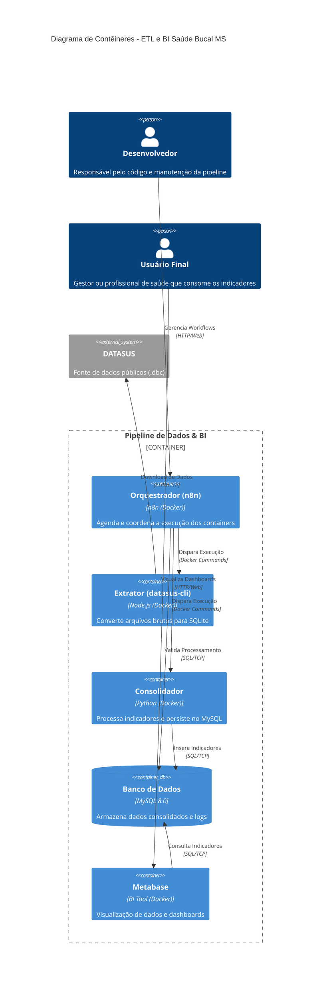

# ETL DATASUS - Monitoramento de Saúde Bucal (MS)

Este projeto automatiza a coleta, extração e processamento de indicadores de produção de saúde bucal do DATASUS, com foco nos municípios do Estado de Mato Grosso do Sul. A solução foi desenhada para ser modular, utilizando containers Docker para garantir a portabilidade e consistência entre os ambientes de desenvolvimento e produção.

## 🏗️ Arquitetura do Sistema

A solução é composta por uma stack de microsserviços orquestrada pelo **n8n**:

* **Orquestrador (n8n):** Gere o fluxo de trabalho, agendamentos e a execução dos containers de processamento.
* **Banco de Dados (MySQL 8.0):** Armazena os dados consolidados, tabelas populacionais e logs de auditoria.
* **Extrator (Node.js/datasus-cli):** Responsável por realizar o download dos arquivos brutos (.dbc) e convertê-los para o formato SQLite.
* **Consolidador (Python):** Script especializado que realiza a leitura dos arquivos SQLite, aplica as regras de negócio dos indicadores de saúde e persiste os resultados no MySQL.



A solução é composta por uma stack de microsserviços orquestrada pelo **n8n**:

* **Orquestrador (n8n):** Gere o fluxo de trabalho, agendamentos e a execução dos containers de processamento.
* **Banco de Dados (MySQL 8.0):** Armazena os dados consolidados, tabelas populacionais e logs de auditoria.
* **Extrator (Node.js/datasus-cli):** Responsável por realizar o download dos arquivos brutos (.dbc) e convertê-los para o formato SQLite.
* **Consolidador (Python):** Script especializado que realiza a leitura dos arquivos SQLite, aplica as regras de negócio dos indicadores de saúde e persiste os resultados no MySQL.

## 🚀 Tecnologias e Ferramentas

* **Docker & Docker Compose:** Containerização e orquestração local.
* **Python 3.10:** Lógica de ETL e integração SQL (Pymysql).
* **Node.js 22:** Ferramenta de CLI para extração de dados públicos.
* **n8n:** Automação de workflow.
* **MySQL 8.0:** Persistência de dados relacionais.

## 📋 Pré-requisitos

Antes de iniciar, certifique-se de ter instalado:
* Docker e Docker Compose.
* Acesso à internet para download das imagens e dos dados do DATASUS.

## ⚙️ Configuração e Instalação

1.  **Clonar o Repositório:**
    ```bash
    git clone [https://github.com/delarissag/n8n-datasus.git](https://github.com/delarissag/n8n-datasus.git)
    cd n8n-datasus
    ```

2.  **Configurar Variáveis de Ambiente:**
    Crie um arquivo `.env` na raiz do projeto. Este arquivo é ignorado pelo Git por motivos de segurança.
    ```env
    DB_HOST=mysql
    DB_USER=root
    DB_PASSWORD=sua_senha_segura
    DB_NAME=indicadores_sus
    ```

3.  **Subir a Infraestrutura:**
    ```bash
    docker-compose up -d
    ```

## 🔄 Fluxo de Processamento

O workflow automatizado executa as seguintes etapas:
1.  **Cálculo de Competência:** Define o mês/ano de busca com base no atraso de publicação oficial.
2.  **Execução do Extrator:** Baixa os arquivos PAMS (Produção Ambulatorial) e os converte.
3.  **Processamento Python:** O script `consolidar_odonto.py` lê o SQLite gerado, filtra CBOs específicos e calcula indicadores como:
    * Primeira Consulta Odontológica Programática.
    * Tratamentos Concluídos.
    * Escovação Dental Supervisionada (6 a 12 anos).
    * Procedimentos Preventivos e Restauradores.
4.  **Persistência:** Os dados são salvos na tabela `producao_odonto_consolidada`.

## 📂 Organização do Repositório

* `/docker`: Contém os Dockerfiles customizados para n8n, Python e CLI.
* `/scripts`: Scripts Python de consolidação de dados.
* `/mysql-init`: Scripts SQL para criação automática das tabelas.
* `/workflows`: Exportação do fluxo n8n para importação manual ou automática.
